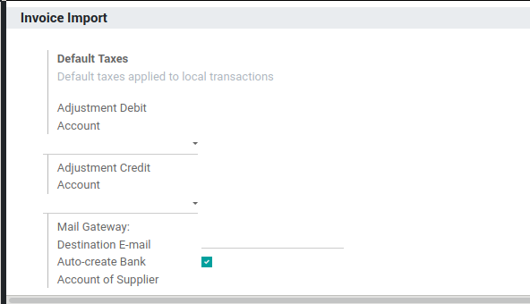

In order to configure the type of invoice created per partner.

Got to:
  - `Accounting` or `Invoicing`
  - `Configuration`
  - `Import Vendor Bill`
  - `Import Bills`

you will find the configuration of each partner.

In order to automatically create bank accounts on QR-bill import:

Go to:

  - `Accounting` or `Invoicing`
  - `Configuration`
  - `Settings`
  - `Invoice Import`

And activate `Auto-create Bank`

